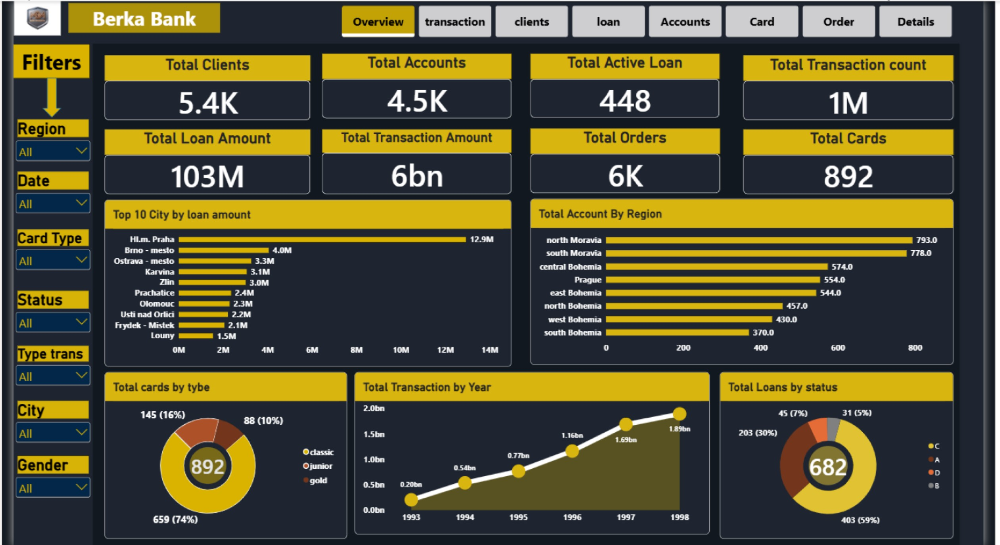
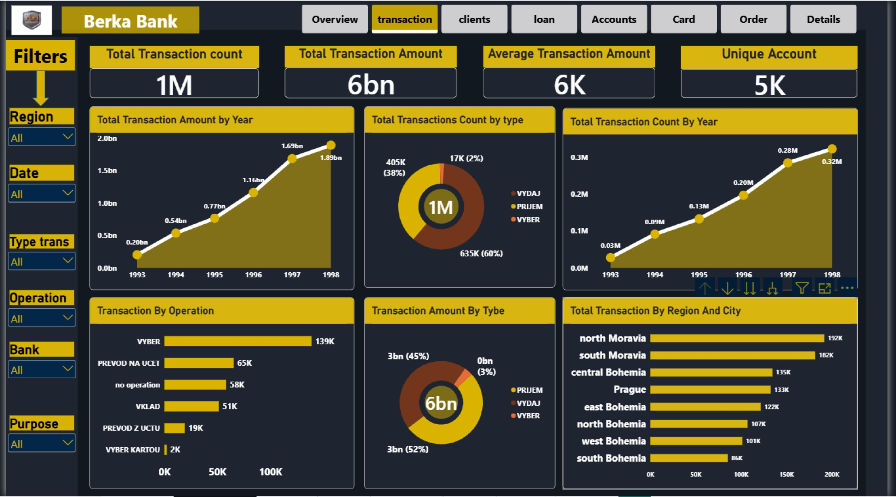
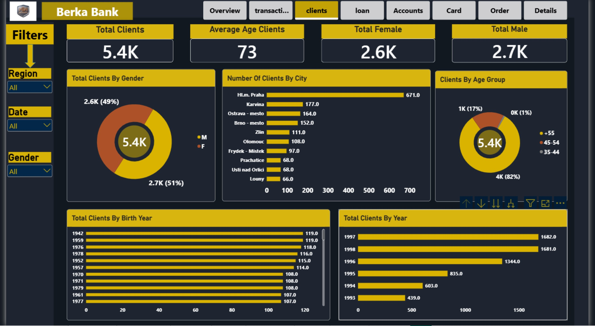
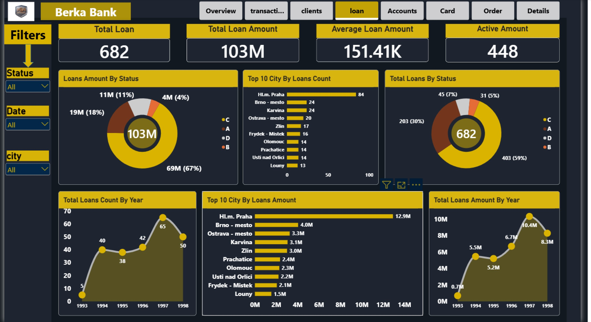
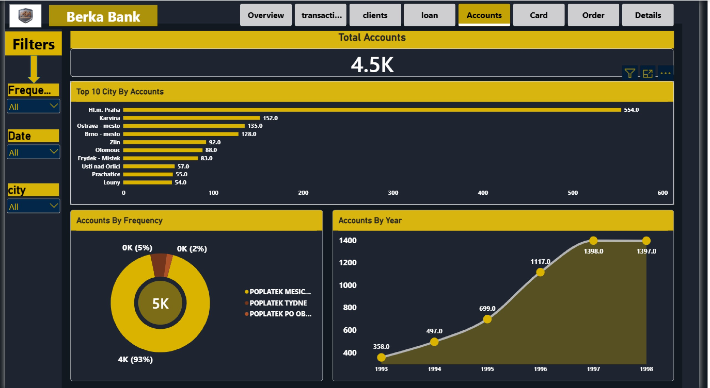
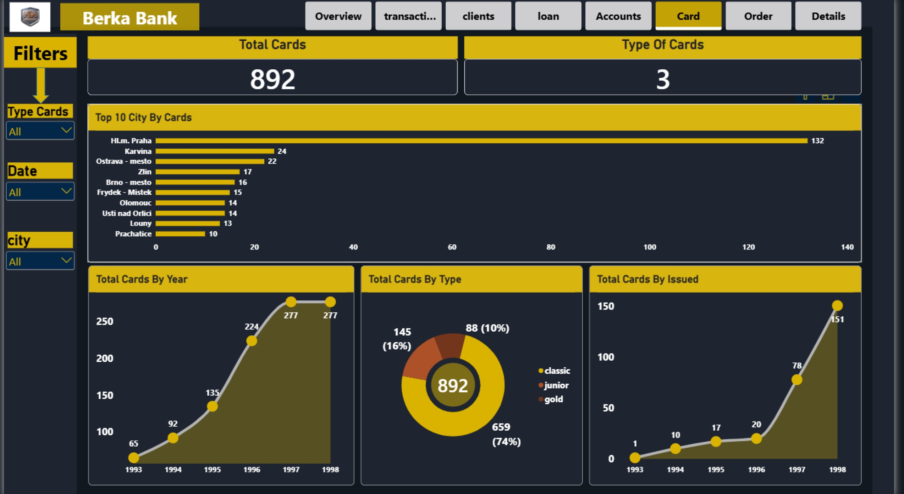
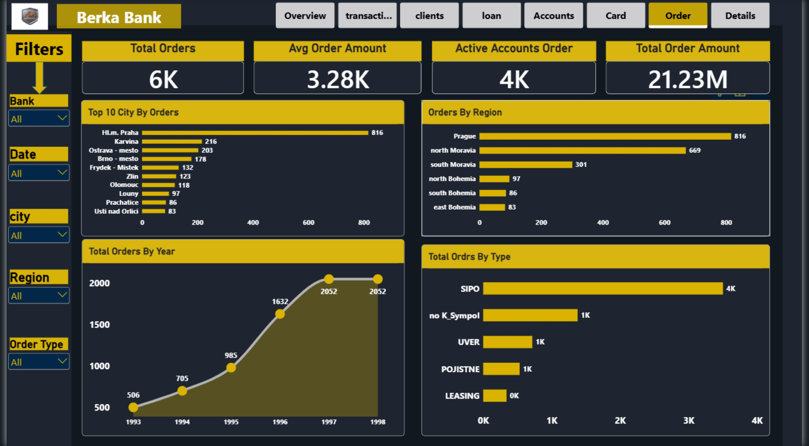
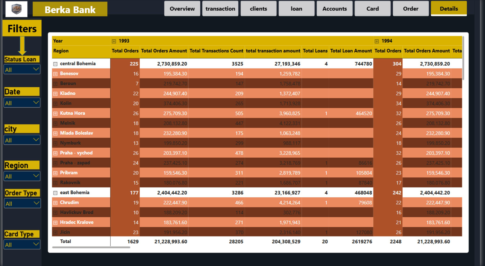

# 🏦 Berka Bank — Power BI Analysis Dashboard

### End-to-end Business Intelligence dashboard analyzing 6 years of Czech banking data (1993–1998)

---

## 📖 Overview

This project analyzes the **Berka Bank dataset** (a well-known real-world Czech banking dataset, sourced from **Kaggle**), covering clients, accounts, loans, cards, transactions, and orders across the years **1993–1998**.

The goal was to build a full, multi-page **Power BI dashboard** that turns raw relational banking data into clear, decision-ready KPIs — helping stakeholders understand client behavior, loan performance, transaction volume, and regional trends across the bank's operations.

- **Dataset source:** Berka Bank Dataset — Kaggle
- **Tools used:** Power BI, Power Query, DAX, Excel

---

## 🧱 Data Model

The dashboard is built on a **star-schema data model** with multiple fact and dimension tables, connected through relationships in Power BI:

- **Fact tables:** `loan fact`, `order fact`, `trans fact`, `card fact`
- **Dimension tables:** `client dim`, `account dim`, `district dim`, `disp dim`, `Date Dim`
- Data was cleaned and transformed using **Power Query** (handling missing values, renaming/typing columns, building relationships) before modeling and visualization.

---

## 📊 Dashboard Pages & KPIs

The report contains **8 pages**, each focused on a specific business area:

### 1️⃣ Overview
A summary landing page combining the top KPIs from every section of the bank's operations.
- **Total Clients:** 5.4K
- **Total Accounts:** 4.5K
- **Total Active Loans:** 448
- **Total Transaction Count:** 1M
- **Total Loan Amount:** 103M
- **Total Transaction Amount:** 6bn
- **Total Orders:** 6K
- **Total Cards:** 892
- **Visuals:** Top 10 cities by loan amount, total accounts by region, cards by type, transaction trend by year, loans by status
- **Filters:** Region, Card Type, Status, Transaction Type, City, Gender

### 2️⃣ Transaction
Deep dive into transaction volume, type, and regional distribution.
- **Total Transaction Count:** 1M
- **Total Transaction Amount:** 6bn
- **Average Transaction Amount:** 6K
- **Unique Accounts:** 5K
- **Visuals:** Transaction amount trend by year, transaction count by type, transaction count by year, transactions by operation type, transaction amount by type, transactions by region & city
- **Filters:** Region, Date, Transaction Type, Operation, Bank, Purpose

### 3️⃣ Clients
Client demographics and growth over time.
- **Total Clients:** 5.4K
- **Average Client Age:** 45
- **Total Female Clients:** 2.6K
- **Total Male Clients:** 2.7K
- **Visuals:** Clients by gender, clients by city, clients by age group, clients by birth year, client growth by year
- **Filters:** Region, Date, Gender

### 4️⃣ Loan
Loan performance, risk status, and geographic breakdown.
- **Total Loans:** 682
- **Total Loan Amount:** 103M
- **Average Loan Amount:** 151.41K
- **Active Loan Amount:** 448
- **Visuals:** Loan amount by status, top 10 cities by loan count, loans by status, loan count by year, top 10 cities by loan amount, loan amount by year
- **Filters:** Status, Date, City

### 5️⃣ Accounts
Account distribution and activity frequency.
- **Total Accounts:** 4.5K
- **Visuals:** Top 10 cities by accounts, accounts by frequency, account growth by year
- **Filters:** Frequency, Date, City

### 6️⃣ Card
Card issuance and type distribution.
- **Total Cards:** 892
- **Card Types:** 3 (Classic, Junior, Gold)
- **Visuals:** Top 10 cities by cards, cards by year, cards by type, cards by issue date
- **Filters:** Card Type, Date, City

### 7️⃣ Order
Order volume, value, and regional performance.
- **Total Orders:** 6K
- **Average Order Amount:** 3.28K
- **Active Accounts with Orders:** 4K
- **Total Order Amount:** 21.23M
- **Visuals:** Top 10 cities by orders, orders by region, order trend by year, orders by type
- **Filters:** Bank, Date, City, Region, Order Type

### 8️⃣ Details
A cross-tab matrix view for granular, year-over-year regional analysis — combining orders, transactions, and loans in a single drillable table (1993–1998, by region).
- **Metrics:** Total Orders, Total Orders Amount, Total Transactions Count, Total Transaction Amount, Total Loans, Total Loan Amount
- **Filters:** Loan Status, Date, City, Region, Order Type, Card Type

---

## 🔑 Key Insights

- **Prague (Hl.m. Praha)** consistently leads across almost every metric — clients, accounts, cards, loans, and orders — confirming it as the bank's primary hub.
- Total transaction volume grew steadily year over year, from under 0.2bn in 1993 to nearly 2bn by 1998.
- The vast majority of loans (67%) fall under status "C" (running, no issues), indicating a healthy loan portfolio overall.
- Card adoption is dominated by the **Classic** card type (74%), with **Gold** cards making up the smallest share.
- Client base is nearly evenly split by gender (51% male / 49% female), with an average client age of 45.

---

## 🛠️ Skills Demonstrated

- Data modeling with star-schema relationships across multiple fact/dimension tables
- Data cleaning & transformation using Power Query
- DAX measures for KPIs (totals, averages, YoY trends)
- Interactive filtering, drill-through, and cross-report filtering
- Dashboard design for multi-page, business-focused storytelling

---

## 📷 Preview

### 1️⃣ Overview

### 2️⃣ Transactions

### 3️⃣ Clients

### 4️⃣ Loans

### 5️⃣ Accounts

### 6️⃣ Cards

### 7️⃣ Orders

### 8️⃣ Details Matrix

---

## 📁 Project Structure
BerkaBankProject/
├── Documentation/
│   └── Business_Questions_Insights.md   # Detailed business insights, Q&A, and recommendations
├── Images/                              # Dashboard preview images for all 8 pages
│   ├── 01-overview.jpg
│   ├── 02-transaction.jpg
│   ├── 03-clients.jpg
│   ├── 04-loan.jpg
│   ├── 05-accounts.jpg
│   ├── 06-card.jpg
│   ├── 07-order.jpg
│   └── 08-details.jpg
└── README.md                            # Project documentation & overview
